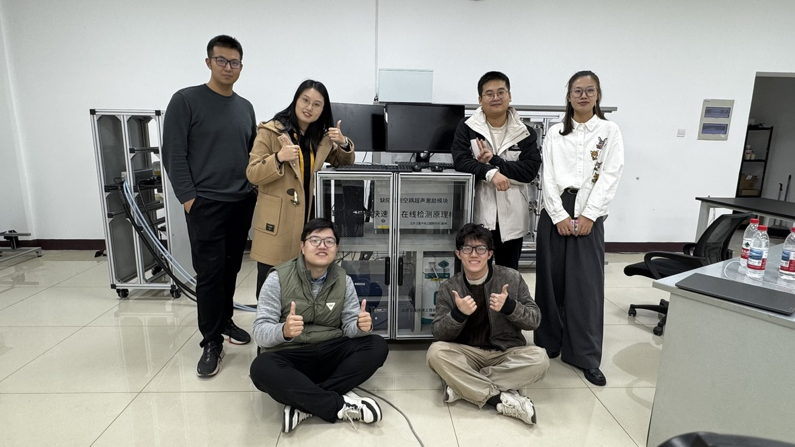

这是一个国家基金项目，我不会在文章中透露任何可能涉及机密的技术细节，如需要修改或删除文章请联系我。

航天设备由于种种限制（比如需要非接触，不能用电磁，不能损伤表面等等）往往要声学检测的方式来进行缺陷检测和日常维护。当当当当，这就需要我们这个实验室出手了，简单来说我们用各种设备来做声学检测，检测金属，检测复合材料。检测的手段有很多，这主要涉及两个方面，如何激励超声波以及如何接收超声波。之所以用超声波是因为波长比较小，能感知到比较细微的缺陷。我就不赘述了

总之这个项目我们要做一个设备，而且马上要结项了（立项了好几年我来了半年要结项了，活都让我们赶上了）。我并非质疑项目书的专业性，但是检测几微米的缺陷确实让人觉得可能是单位写错了。所有的指标都很难实现，就算实现了也很难复现，而且所有的实验都很难控制变量（声波实在是变换莫测，尤其激光！）。但是那段时间还是很充实的，每天都聚在一起干干干，然后晚上一起去吃鸡公煲。

要把所有东西攒到一起，你别说，总会有办法的。数据有加密狗就用优盘拷，电脑版本不一样就用线连起来，程序模块化集成起来一人一个页面。马特拉波（Matlab）你真难用，不要以为你辈分大我就不说你。最后当然顺利结项了，虽然出现种种意外情况，但是你知道的，总是能顺利结项的，没有什么事情值得担心。你唯一应该做的就是期待下一顿饭，期待一个好天气，期待一只给你摸的小猫小狗。

