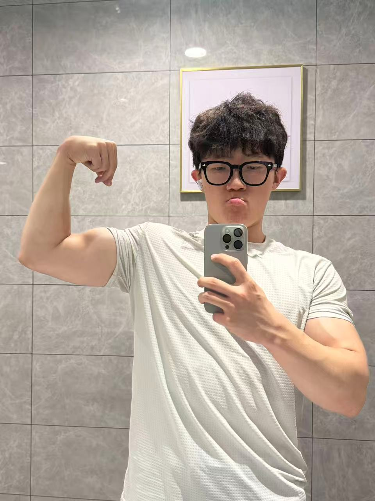

但是说实话我也没什么话语权，没有控制过饮食，没有研究过补剂，也没有打磨过动作，我感觉大多数人应该都是这样吧。

对我来说健身已经没有什么目的性，不是说要减掉多少斤，推起多大的重量，我觉得人就应该健身，这是已经是我的一种生活习惯。而且我健身就是觉得有肌肉比较帅比较好看，也没有什么特别的原因。而且这正好也是一种我能选择的，健康的生活方式。

健身不需要苦大仇深，不需要因为吃一点高热量食物就惩罚自己多跑几公里。施展自己身体机能的机会，食物，是健身带给我们的奖励，不是休息和享受食物的惩罚。

好想打比赛啊。