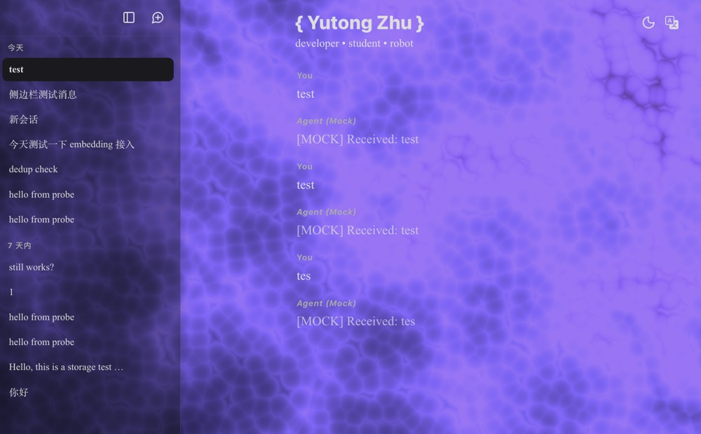

<div align="center">


</div>

This is just an Agent project for practice. I will integrate it into one of my websites as a full-stack AI web application layer, but I may also design it to be an Agent module that can run in a container and communicate with the outside world via APIs, making it easy to integrate and deploy.

I built this Agent project and my web application completely from scratch. They may not be very user-friendly, but I can design them according to my own preferences, which gives me a great sense of satisfaction. I will probably design only some simple tool calls and try to implement complete session management (actually, I think the Agent loop will become very simple in the future because models are improving rapidly, though I can't figure out how to solve the hallucination problem; for now, context engineering still seems applicable in many scenarios). The components will be a cache layer, a storage layer, and a retrieval layer (approximately that concept). I'll implement them using Redis, PostgreSQL, and embedding vectors respectively. This is a good opportunity to learn about Redis and PostgreSQL features: Redis stores data in RAM and is fast for key-based retrieval, while PostgreSQL stores data on disk, so it's slower but provides persistent storage. I'll also learn how sessions are stored in tables, what the schema looks like, and that each session has a UUID. In short, I will try to create the best user experience (I have a people-pleasing personality).

The session management system is set up, adopting the mainstream dual-storage mode of session KV + vector database. PostgreSQL stores everything, Redis caches the last 10 messages to ease concurrent write pressure and speed up session message reads, and the vector database enables cross-session message retrieval (There are actually many design possibilities here. For example, an external knowledge base could be designed, such as some personal information of mine; or a tool description vector database could be used to match the most suitable tool to call. Here, we simply store some high-value content into the vector database, such as user preferences, decisions, personality, etc.).

It is the three-tier storage structure mentioned above. Actually, there isn't much data to store; there are only two tables in total: the sessions layer is fully stored in PostgreSQL, including uuid, user_id (an Auth mechanism will be needed later to store data and implement multi-user, multi-session functionality where each user manages their own sessions), messages, created_at, update_at, where messages are stored as JSON. Then there is the semantic layer, used to store semantic vectors. The table is the same, except it has an additional embedding vector. Later, an embedding method needs to be implemented to selectively convert segmented sentences into embedding vectors for storage (Semantic segmentation has many subtleties; multiple methods can be chosen based on the scenario. Also, for the Agent's vector database retrieval, it is generally designed as a tool_call, and tools are called when needed for querying). In short, Minimax and deepseek have already helped me build some parts, but I do have full control over all data fields, message storage methods, and the total of 4 APIs:

``` curl

GET /api/sessions/{session_id} 用来拉取已有某个会话内容
POST /api/sessions/{session_id}/messages 用来发送消息
POST /api/session 用来创建会话
GET /api/users/{suer_id}/sessions 拉取某个用户的已有会话列表

```

I can also write some status checks or error codes for them to practice API specifications.

<div align = "center">



</div>

Next, I can prepare to integrate a complete Agent conversation API. The backend calls the Agent via HTTP requests. The Agent executes the runtime loop in a container, calls tools, and eventually obtains a final answer, which is split and returned, then stream-rendered in the frontend message window. That's roughly it. The Agent-side tool_call, backend RAG library, Auth authentication, and user management will be gradually added later.