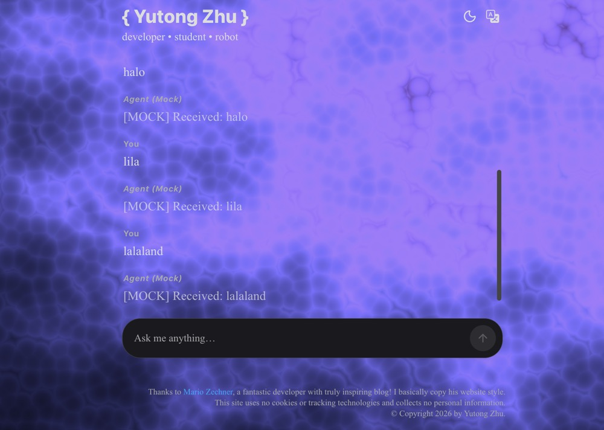
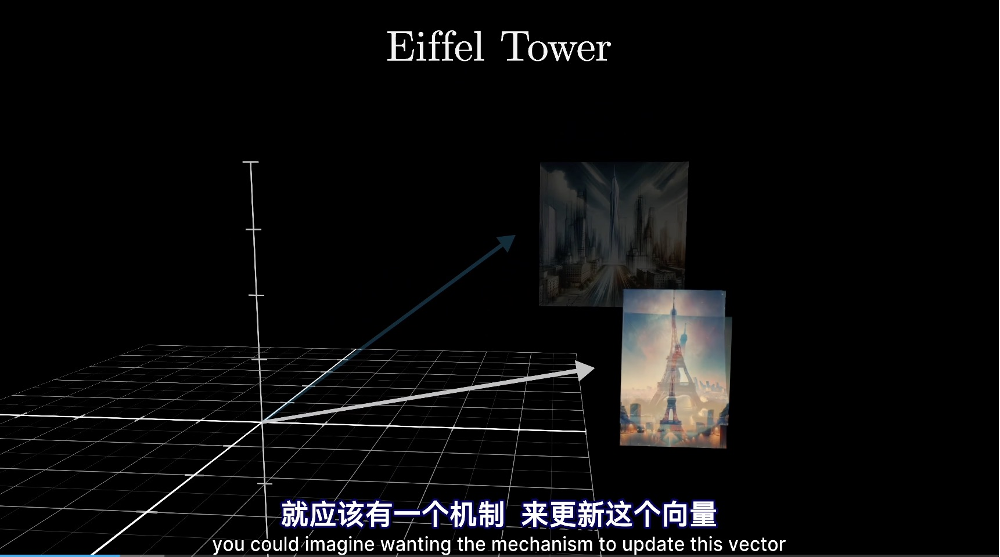

<div align="center">



</div>

只是一个用于练习的Agent项目，我会把它接入我的一个website中作为一个ai web应用层的全栈项目，但是我可能也会把它设计成一个能在容器中运行通过API与外界通信的Agent模块，方便接入和部署。

我完全从零开始构建了这个Agent项目和我的web应用，它们可能并没有很好用，但是我可以按照自己的喜好设计它们，这也让我感到很满足。我应该只会设计一些简单的tool_call，以及试着实现完整的会话管理（其实我认为Agent循环以后会被设计的非常简单，因为模型的能力提升很快，虽然幻觉问题我想不出如何解决，目前看来上下文工程在很多场景下还是有应用的），分别是缓存层、存储层、检索层（大概是这么个意思吧）。分别用Redis, PostgreSQL和embedding向量来实现，这里可以学习一下Redis和PostgreSQL的特性，Redis存在RAM中按键检索所以快，PostgreSQL存在磁盘中所以慢但是能持久储存。以及会话是如何储存在表中的，schema是什么，每个session都有一个UUID等等。总之我会试着创造最佳的用户体验（我是讨好型人格）。

会话管理系统搭好了，采用主流的session KV + 向量库的双存储模式，PostgreSQL全量存储，Redis缓存最近10条消息缓解并发写入压力，加快会话消息读取，向量库实现跨会话消息检索（这里其实有很多可以设计的地方，可以根据设计外部知识库比如我的一些个人信息；或者工具描述向量库，从而匹配最合适的调用工具。这里就简单的将一些高价值内容存进向量库，比如用户的偏好、决策、性格等）。

就是最上面说的三层存储结构，其实要存的数据也不多，一共就两个表：sessions层在PostgreSQL中全量存储。包括uuid, user_id（后面必须要做Auth鉴权才能存进去数据，才能实现多用户多会话，每个用户管理自己的会话的功能）, messages, created_at, update_at，其中messages以json形式存储数据；还有就是语义层，用来存储语义向量，同样的表只是比上面的多一个embedding向量，后续需要实现一个embedding方法来把切分后的语句选择性转换成embedding向量存储（语义切分这里也大有门道，可以针对场景选择多种方法。还有Agent的向量库检索，一般设计成tool_call，在需要的时候调用工具进行查询）。总之，Minimax和deepseek帮我做好了一些，但是我确实掌握着所有数据字段和消息储存方式，以及总共包含的4个api：

``` curl

GET /api/sessions/{session_id} 用来拉取已有某个会话内容
POST /api/sessions/{session_id}/messages 用来发送消息
POST /api/session 用来创建会话
GET /api/users/{suer_id}/sessions 拉取某个用户的已有会话列表

```

我还可以给他们写一些状态检查或者错误码之类的，来练习一下API规范。

<div align = "center">


</div>

之后我接入一个完整的Agent对话api，后端通过http请求调用llm API，llm会自行选择是否进行工具调用（这是通过llm返回结构化信息给Runtime实现的，Runtime会读取结构体中指定的tool以及parameter），Agent在容器中执行Runtime循环（循环指的是执行工具返回执行结果给llm，llm进行下一步思考，返回消息），最终得到final answer（如何判断是否是final answer呢，有几种方法：1. 让大模型自己判断；2. 当不再发生工具调用的时候就认为是final anser；3. 超过指定步数限制，直接返回final answer）。Runtime将消息切分返回然后SSE流式渲染在前端消息窗口中，大概就这样。Agent端的tool_call，后端的RAG库，Auth鉴权用户管理，这些都可以慢慢集成。

用户鉴权

RAG库接入有两种主流方法，可以在每次回复前都进行一次检索，将检索结果拼进messages里面；也可以将RAG功能设置为一个Agent tool，让llm自行决定要不要调用RAG tool。第二种方法更合理一点，通过检测当前问题是否需要跨会话检索或者长期记忆，从而有目的的检索知识库里面的信息。主流的检索方式往往是向量召回 + 关键词/BM25 -> rerank 的检索方式，然后再将结果返回给llm。RAG的接入和检索方式都在Agent runtime设计好了，那么RAG向量库到底要怎么生成呢。

我理解的RAG库就是一堆语句信息（或者说语义）在一个高维空间的集合，每个语句都被映射成一个向量，而将它们映射为向量的这个模型是经过大量语句训练过的（就像ChatGPT一样），它很清楚不同语句之间有什么联系（比如红桃和爱丽丝，戒指和爱情），这些联系体现在高维空间中两个语句向量之间的距离（可以将其想象为一个三维坐标系中的两个物体）。所以检索的过程就像我们刚刚说的，将我们的询问转换为向量，去语义空间里计算一下距离哪些向量比较近，这些就是我们要的“记忆”，然后将它们提取出来、拼接，返回给llm。这就是RAG库的组成，碰巧我还知道这些语句和词汇都是由token组成的，如何合理选取它们并转化为RAG向量自然很大程度上影响了后面的检索结果（就像把“橘子是世界上唯一的水果”这句话转化成向量和将“橘子”、“世界”、“唯一”、“水果”分别转化成向量会导致最后的检索结果不同一眼）。

<div align = "center">



</div>

那么该如何切分语句并将其转化为RAG向量呢。我认为切分要考虑到语义完整性、结构、以及embedding模型的能力。

