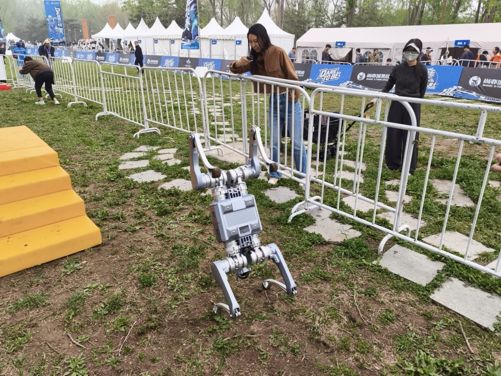
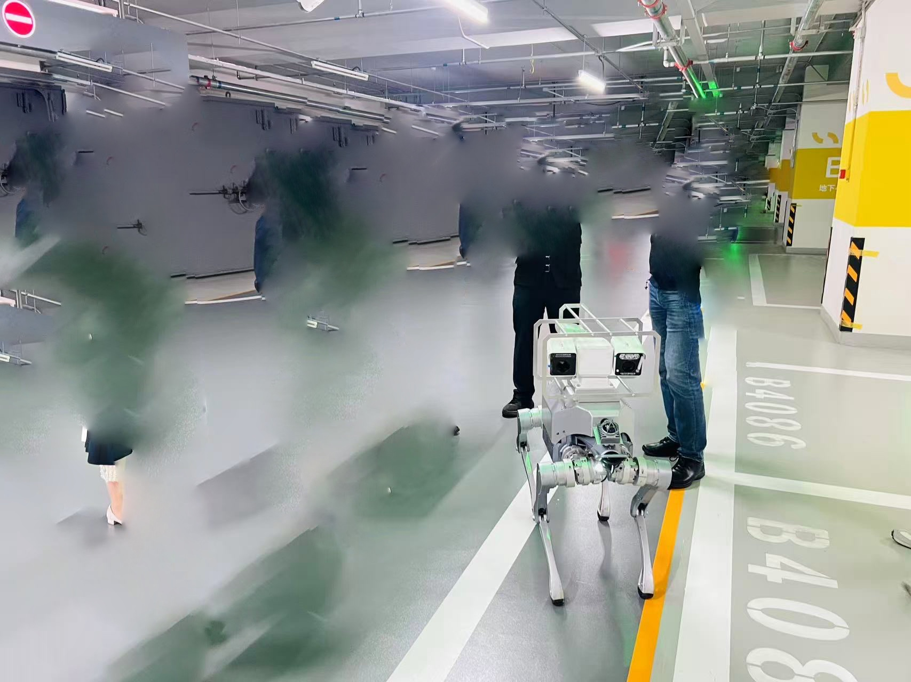
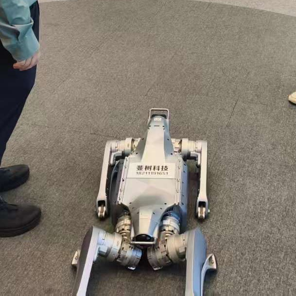

My First Internship Was Quite Surreal

At first, I just wanted to explore the current job market with my girlfriend. With school keeping me busy, I thought I'd try my luck to see if I could find an internship that wasn't too strict about on-site attendance or allowed remote work.

At that time, I was more interested in embodied intelligence, even though I didn't realize I was actually more interested in VLA. In any case, I didn't have much time to dive into the things I was passionate about. Actually, I'm interested in many technologies: embedded systems, communications, SaaS, full-stack projects (which I think are the future trend), and so on. Like every young guy who loves tech but feels a bit lost, I thought I wouldn't stop learning, but maybe I needed to find a job first.

In short, I had never interned before and didn't know what working was like. Maybe it's similar to school: put in some effort, get a salary, make some friends, and importantly, learn something and enrich your experience. We wandered around the exhibition hall. My girlfriend had a double degree in economics and law, yet even so, there were very few suitable positions on the market, and she couldn't help feeling a bit disappointed. I was from a traditional engineering background (even though I didn't really like that major...), and with a decent academic record, I felt it was relatively easy to land a job. To be honest, I think most jobs could be done perfectly well by any undergraduate or graduate student from any school; it's just that there are too many people—too many people. (That inevitably leads to talk about distribution systems, which is the topic I least want to discuss, and it's also a taboo one...) I asked a few companies, handed out some resumes (I remember they were color-printed, costing 1 yuan or 50 cents per sheet), and asked if they were recruiting interns. In the end, only this company called me back.

Actually, it was because they were a startup and were extremely, extremely short-staffed, but the pay was quite good—300 yuan a day—and I could get involved in projects from the ground up. Although I didn't really understand how these things worked at the time, now I feel that startups teach you more than big companies, because with fewer people, you take on more core tasks, collaborate more closely with others, and iterate faster—but it's also more exhausting. At that time, the company was like Pangu opening up the world: they only had an ax... and a few robot dogs. As I understand it, the boss had boasted that they could definitely do the projects, but in reality nothing had even started yet. So he quickly recruited staff. Making a company is pretty easy, huh (if you have money).

Specifically, the company was using embodied intelligence rather than researching it in a general sense (it's all about business and making money, obviously). I probably shouldn't reveal who the client was. Anyway, the robot dogs were to be used in an inspection scenario: checking around for anomalies, seeing whether the pressure gauge readings were normal, and checking whether those bottles and tanks were leaking, in order to replace some hard-working workers (though this actually increases job opportunities—it replaces some physical labor, but also creates more positions for maintaining and developing robot dogs; but then again, many people don't have the freedom to choose another occupation, and who can say their own job is more meaningful?). How to do this? First of all, it's all about buying things. Many industrial cameras already have built-in solutions, such as fire detection, infrared thermal radiation detection, etc. Just mount them on the robot dog and you're done. But the client certainly had additional requirements, like recognizing instrument readings, corrosion and rust, liquid and gas leaks, etc. These required camera-based vision solutions (though for leaks, other sensors would actually be better, but that involves hardware and signal processing, and the company didn't seem to have anyone skilled in those areas—actually, the people in the company didn't seem to really know what they were doing).

Actually, if we could really use VLA, it would be the best of the best. Now I realize that the practical application of this technology is still very challenging—unlike an Agent, the risks in a production environment are extremely difficult to predict, and even an Agent can't be said to be truly deployed in production. So I chose the reliable OpenCV, received the video data from the cameras, split it into frames, and then identified the gauge dial in each image to read the numbers. The whole task can be simply divided into two parts: localization (i.e., detection) and reading. First, detect the entire dial, then identify the scale markings and pointer, and finally calculate the reading based on the scale and pointer. That's all there is to it. Actually, the most important thing is the dataset. This task isn't hard, but images from the production environment? None! Images of the dial? Only one or two types! Make the dial pointer move? You can't just move it! Eventually, I had to find a manufacturer selling the same gauge on Taobao and obtained some images to supplement the dataset. Even so, the dataset was still far from sufficient. I trained on open-source gauge datasets from the internet and then fine-tuned for the specific scenario, achieving decent results. Because in the entire factory, there were only a few types of gauges that needed to be recognized. Specifically, I just froze the first 10 layers of YOLOv12 and fine-tuned the later detection heads with the gauge data.

After localizing the dial, I found an open-source dataset that could identify the pointer tip, maximum and minimum scale markings, and the gauge center. Then all I had to do was use OCR to read the maximum and minimum values, calculate the pointer's arc based on the pointer tip and the gauge center, and thus determine the current reading. However, in the dataset, the dial filled the entire image, while in actual shot images, the dial only occupied a small region. So after detection, I cropped the image according to the YOLO bounding box and then fed it into the next model for detection. Along the way, I encountered many issues, such as OCR recognition problems, logic issues in reading calculation, and a bunch of other tedious stuff. In short, after adding countless expert rules, it reached a usable state.

Actually, I learned a lot more valuable things from the deployment side. This entire platform wasn't an online detection solution; after the robot dog completed its inspection round, it uploaded the videos to a cloud server, and then detection results were produced. This made development easier. The whole solution was based on a platform that published tasks and distributed them via Redis message queues to various consumer groups. After consumption, each microservice executed its task and returned results via APIs. Each microservice ran in Docker, communicating through API ports, with defined payload fields to ensure messages were passed correctly according to the logic. I developed one of these microservices and finally got it successfully integrated with the robot dog on a Linux server.

