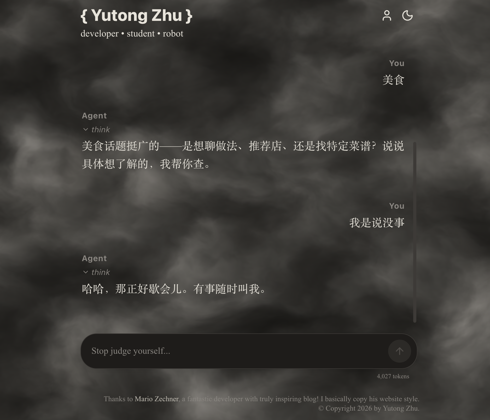

<div align="center">



<div align = "center">

Agent doesn't seem so profound—context injection, session management, structured tool calls, deciding when to end and return a message to the user. That's about it, right? (I'll definitely eat my words.)

First, I don't intend to build some mind-blowing Agent like Claude Code or Codex. Although I think the impressive agents on the market are all coding agents, they simply have special architectures and tools designed for specific scenarios, needs, or tasks. It might be specialized context management, different A2A communication protocols, session management architecture design, the logic design of the agent loop, etc. Honestly, I don't fully understand. Intuitively, I feel the framework "pi" is very good and relatively foundational, and I like its founder and the company's philosophy. (Things infused with passion tend to be liked by others, right?) So let's begin.

Regarding the agent's tool system, we can discuss it from three aspects: tool definition, tool loading, and tool execution. `tool_call` or `function_call`—the principle is to first tell the LLM which tools it can call at any given time. The LLM decides when to call them, and the calling method is to have the LLM return structured data (a JSON schema). The runtime reads this structured data, executes the corresponding tool (often some scripts or web searches), processes the tool output, and summarizes it back to the LLM. In essence, this gives the large model a method to interact with the real world through the network. It's just that the LLM isn't smart enough yet, and its capabilities are insufficient (context), which is why all these subagents, MCPs, context engineering, state management, and tool integration have emerged. I think once LLM intelligence reaches a certain level, just give it a bash, and it will handle everything. But that should be impossible—no one would entrust themselves to probability.

The `tools` here are generated using the `createTools()` function when we create the service. This function is in `index.js`, and it generates the JSON schemas for all tools and passes them as an array to `tools`. So when creating a new tool, remember to register it there.


<div align = "center">

Back on track, a tool definition has just three variables: `name`, `description`, `parameters`. These are the tool's name, description, and parameters. They are API protocol fields, as specified by the OpenAI Chat Completions API. That is, when making a Completion HTTP request, this is how you pass them. Other fields include `model`, `messages`, `tool_choice`, and their structure. The tool field information gets loaded into the context at the start of each loop iteration. It isn't placed after the messages; it's just loaded as the `tools` field. How to handle this information is the provider's job. (I recall research saying context engineering is very important and guides the LLM. Generally, the earlier something appears in the context, the greater its influence, but this isn't considered when loading tools.)

After preparing the tools, we start actually creating the agent. First, we need to register the tools we've just created. This is to ensure the LLM correctly returns the structure for calling the tool and that the structure is properly executed by the runtime. (I'm talking about registration when initializing the agent; actually, when creating a new tool, you handwrite the schema and then register it in `index.js`.) Based on our purpose, registration consists of two parts: placing the tool's name and corresponding instance into a Map (where `execute` is also present), so when the LLM returns a schema, we look up the instance in the map by the schema's `name` and execute it; and the fields passed to the LLM to tell it which tools are available and how to use them—just passing `name`, `description`, and `parameters`:

```Typescript
this.toolSchemas = tools.map((t) => ({//tools is a constructor parameter (think of it as a variable in a struct), tools:Tool[] Here tools is defined as an empty array but with a defined structure containing three parameters.
  type: "function",
  function: {
    name: t.name,
    description: t.description,
    parameters: t.parameters,
  },
}));
```

The `tools` here are generated using the `createTools()` function when we create the service. This function is in `index.js`, and it generates the JSON schemas for all tools and passes them as an array to `tools`. So when creating a new tool, remember to register it there.

Alright, alright. The LLM knows what tools you have and how to use them, and the Agent knows how to handle the structure returned by the LLM and execute the corresponding tools. All of this is to make this LLM—which only knows how to talk—actually do some real work. Let's get the loop running, constantly appending messages to stuff the LLM full. It's not that smart after all, is it?

<div align = "center">