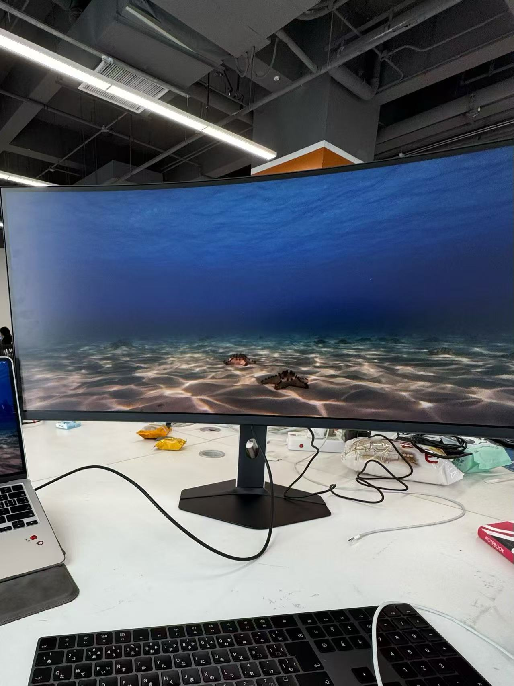

My first internship was quite dramatic...

At first, I just wanted to learn about the current job market with my girlfriend. School was busy, and I wanted to try my luck to see if there was any internship that didn't require strict on-site attendance or could be done remotely.

I was interested in embodied intelligence at the time, even though I didn't realize I was actually more interested in VLA. Regardless, I didn't have much time to dive into what I was passionate about. In fact, I'm interested in many technologies: embedded systems, communications, SaaS, full-stack projects (which I think is the future trend), and so on. Like every young person who loves technology but feels lost, I thought I wouldn't give up learning, but maybe I needed to find a job first.

Anyway, I had never interned before, and I didn't know what working felt like. Probably similar to school: put in some effort, earn some salary, make some friends, and important to learn something and enrich my experience. We wandered around the exhibition hall. My girlfriend double-majored in economics and law, but even so, the number of suitable jobs in the market was painfully small, and she couldn't help but feel disappointed. I was from a traditional engineering background (though I didn't really like the major...), and with a decent educational background, I felt it was relatively easy to find a job. To be honest, I think most jobs could be done perfectly well by any undergraduate or graduate student from any school; it's just that there are too many people, too many people. (It's inevitable to talk about distribution systems, but that's the topic I dislike most, and it's a taboo topic...) I asked a few companies, handed out some resumes (I think they were color-printed, costing 1 yuan or 0.5 yuan per page), and asked if they were hiring interns. In the end, only this company called me back.

Actually, it was because they were a startup, very, very short on people, but the pay was quite good: 300 yuan a day, and I could follow some projects from scratch. Although I didn't know how things worked at the time, now I feel that startups teach you more than big companies, because with fewer people, you take on more core tasks, collaborate more closely with others, and iterate faster, but it's more tiring. Back then, the company's situation was like Pangu creating the world: they had only an axe... and a few robot dogs. I understood that the boss had boasted that the project would definitely be done, but in reality nothing had started, so he quickly recruited. Speaking of which, starting a company is pretty easy, if you have money.

Specifically, this company was using embodied intelligence rather than researching it broadly (business, making money, of course). I probably shouldn't say who the client was. In short, the robot dog was to be used in an inspection scenario: check whether there were anomalies here and there, whether the pressure gauge readings were normal, whether those bottles and cans were leaking, to replace some hard-working workers (though this would actually increase job opportunities in a way, replacing some labor-intensive roles, but also adding more people to maintain and develop robot dogs. But then again, many people don't have the freedom to choose such careers, and who can say their own job is more meaningful?). How to do this? First of all, buy, buy, buy. Many industrial cameras already have built-in solutions, like fire detection, infrared thermal radiation detection, etc., and you just mount them on the robot dog. But the client definitely had additional requirements, such as recognizing instrument readings, corrosion, rust, fluid/gas leaks, etc., which required some camera-based vision solutions (actually, leaks are better detected with other sensors, but that's related to hardware and signal processing, and the company didn't seem to have anyone skilled in that area. In fact, the people in the company didn't seem to know exactly what they were doing).

Honestly, if we could really use VLA, that would be the best of the best. Now I understand that practical application of this technology is still very challenging. Unlike Agent, the risks in production environments are extremely unpredictable; even Agent is hard to deploy in real production. So I chose reliable OpenCV: receive video data from the camera, split it into image frames, then identify the dial in the image and read the value. The whole task can be simply divided into two parts: localization (i.e., detection) and reading. First identify the entire dial, then identify the scale marks, pointer, etc., and then read based on the scale and pointer. That's basically it. Actually, the most important thing is the dataset. The task isn't difficult, but images from production environments? None! Images of dials? Only one or two types! Making the dial pointer move? Can't just move it arbitrarily! In the end, I found the same dial manufacturer on Taobao and got some images to supplement the dataset, but even then, it was far from enough. I trained on open-source dial datasets online and then fine-tuned for the specific scenario, which finally achieved good results. Because in the whole factory, there are just a few types of dials that need recognition. Specifically, I froze the first 10 layers of YOLOv12 and fine-tuned the detection head with dial data.

After localizing the dial, I found an open-source dataset that could identify the pointer tip, min/max scale marks, and the dial center. Then by OCR-ing the max and min values and calculating the pointer angle based on the pointer tip and center, I could compute the current reading. But the dials in the dataset filled the entire image, while in actual shots the meter only occupied a small part. So after detection, I cropped according to the YOLO bounding box and fed it into the next model for detection. Along the way, I encountered many issues like OCR recognition errors, reading calculation logic problems, and so on. In short, after adding countless expert rules, it reached a usable state.

Actually, I learned more useful things about deployment. The whole platform was not an online detection solution. The robot dog patrols and sends video back to a cloud server, then results are produced. This made development more convenient. The entire solution was based on a platform. After publishing tasks, the platform distributed them to consumer groups via Redis message queues. After consumption, results from each microservice were sent back via API. Each microservice ran in Docker, communicating through API ports, with defined payload fields to ensure messages were passed in the correct logic. I developed one of the microservices and finally integrated it successfully with the robot dog on a Linux server.