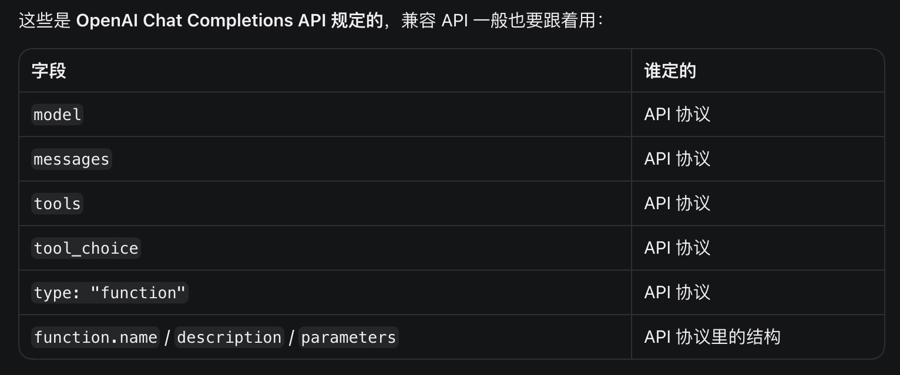

Agents don't seem that mysterious—context injection, session management, structured tool calls, deciding when to end and then returning a message to the user. That's about it, right? Let me try it myself. (I'll definitely be eating my words.)

First of all, I'm not trying to build some super awesome Agent like Claude Code or Codex. Although I think these awesome Agents on the market are actually all coding Agents, they just have special architectures and tools designed for specific scenarios, needs, or tasks. Maybe it's special context management, or different A2A communication protocols, session management architecture design, the logic design of the Agent loop, and so on. Actually, I'm not quite sure. Intuitively, I feel the pi framework is very good and relatively basic, and I like its founder and the philosophy of their company. (Things infused with passion become likable, right?) So let's get started.

An agent's tool system can be discussed from three aspects: tool definition, tool loading, and tool execution. The principle behind tool_call or function_call is to first tell the LLM which tools it can invoke at any given time, and the LLM decides on its own when to invoke them. The way to invoke is to have the LLM return structured data (a JSON schema). At runtime, the structured data is read and the corresponding tool is executed (often a script or an online search), then the output is processed and summarized before being returned to the LLM. In essence, this gives the model a way to interact with the real networked world. It's just that LLMs aren't smart enough or capable enough (context), which is why all these subagents, MCPs, context engineering, state management, tool integration, and other constructs came about. I think once LLM intelligence reaches a certain level, all you'd need is to hand it a bash and it would implement everything itself—but that's probably impossible. No one would entrust themselves to probability.

Getting back to the point, tool definitions involve just three variables: `name`, `description`, and `parameters`—the tool's name, description, and parameters. These are API protocol fields, i.e., those specified by the OpenAI Chat Completions API. In other words, when making a Completion HTTP request, you pass them that way, along with other fields such as `model`, `messages`, `tool_choice`, and their internal structures. During each Loop iteration, the tool's field information is loaded into the context—not appended after the messages, but loaded as a `tools` field. How to process this information is the provider's job. (I recall research saying context engineering is very important, as it plays a guiding role for the LLM. Generally, the earlier content appears in the context, the greater its influence. However, when loading tools, there's probably no need to worry too much about that.)

