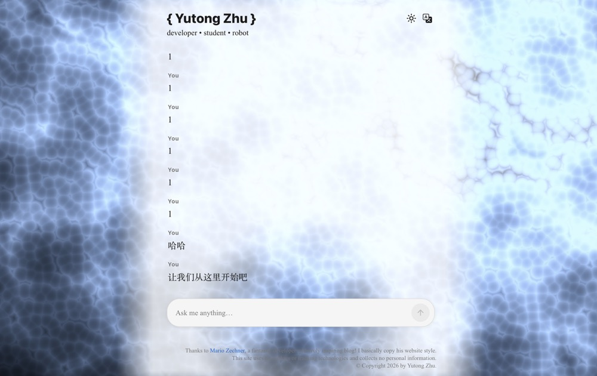

Agents don't seem that mysterious—context injection, session management, structured tool calls, deciding when to end and then returning a message to the user. That's about it, right? Let me try it myself. (I'll definitely be eating my words.)

First of all, I'm not trying to build some super awesome Agent like Claude Code or Codex. Although I think these awesome Agents on the market are actually all coding Agents, they just have special architectures and tools designed for specific scenarios, needs, or tasks. Maybe it's special context management, or different A2A communication protocols, session management architecture design, the logic design of the Agent loop, and so on. Actually, I'm not quite sure. Intuitively, I feel the pi framework is very good and relatively basic, and I like its founder and the philosophy of their company. (Things infused with passion become likable, right?) So let's get started.