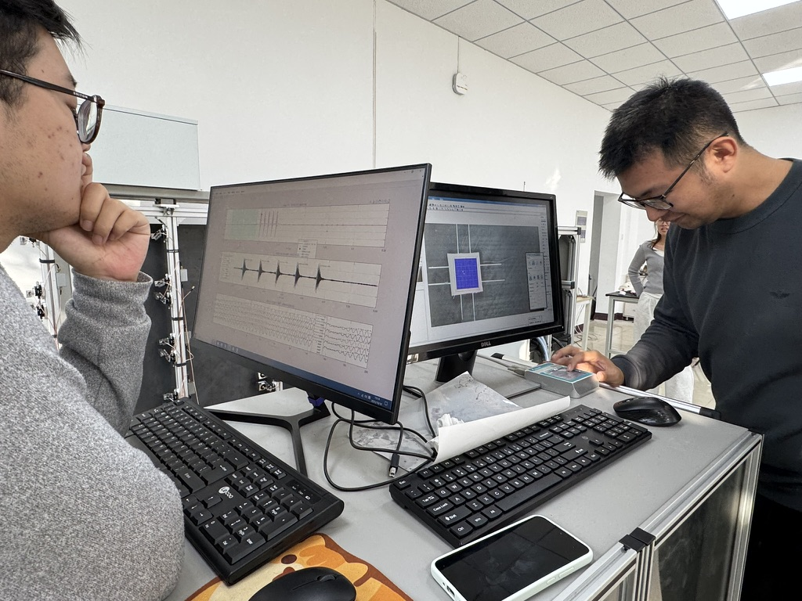

This is a nationally funded project. I will not disclose any technical details that may involve confidentiality in this article. If you need to modify or delete the article, please contact me.

Aerospace equipment often requires acoustic inspection methods for defect detection and routine maintenance due to various constraints (such as the need for non-contact, no electromagnetic interference, and no surface damage). Ta-da! This is where our lab steps in. In simple terms, we use various devices to perform acoustic inspection on metals and composite materials. There are many detection methods, mainly involving two aspects: how to excite ultrasonic waves and how to receive them. Ultrasonic waves are used because their short wavelengths allow detection of relatively subtle defects. I won't go into detail.

In short, this project required us to build a device, and it was about to be completed (the project was initiated years ago, and I joined half a year before its completion—we got to do all the work). I'm not questioning the professionalism of the project proposal, but detecting defects of a few micrometers really makes one wonder if the unit was a typo. All the indicators were extremely difficult to achieve, and even if achieved, they were hard to reproduce. Moreover, controlling variables in all experiments was very challenging (sound waves are truly unpredictable, especially lasers!). But that period was quite fulfilling—we gathered every day to work hard, then went out for chicken pot in the evenings.

You might say there's no way to put everything together, but somehow there's always a way. If the data has a dongle, copy it with a USB drive; if computer versions differ, connect them with a cable; modularize the program so each person has their own page. Matlab, you are so hard to use—don't think I won't call you out just because you're a veteran. In the end, the project was successfully completed. Although various unexpected situations arose, you know how it is—completion always happens eventually, and there's nothing to worry about. The only thing you should do is look forward to the next meal, a nice weather, and a little cat or dog that lets you pet it.

