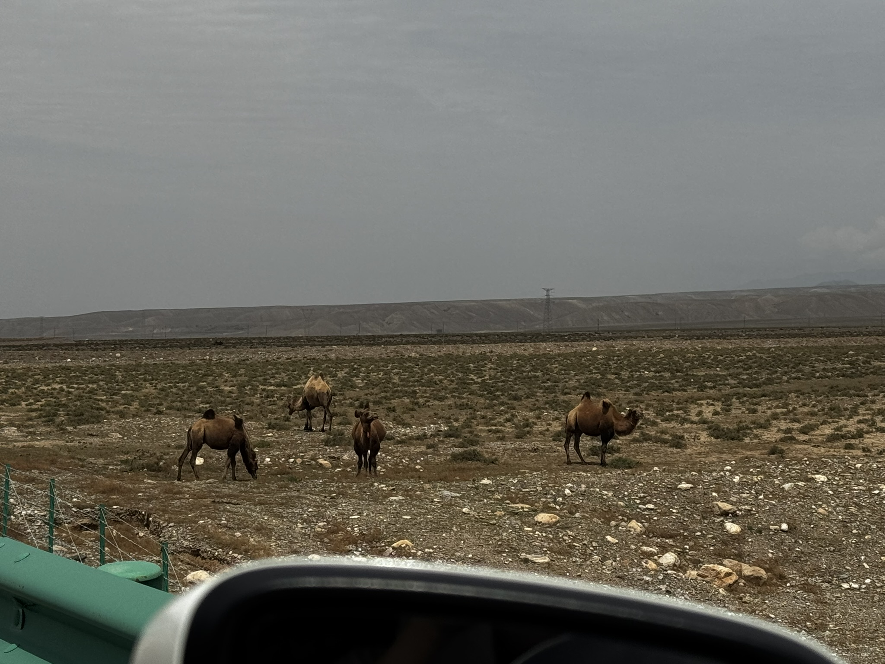

这是我们第几次旅行了？我也数不清了，虽然去的都是周围的小地方，但是以后我们一定会出国，去大海上，到世界的边缘，站在最奇怪的那颗石头上或者潜到水下。自驾真是最好的旅行方式，不会像走路那么累，可以灵活安排自己的行程，也可以随时停下来休息，如果路上车很少而且去这种开阔的地貌开车会很舒服。车上可以放吃的和饮料，更重要的是能听音乐（以后一定要买一个音响效果很好的车），还能拉上自己的爱人和朋友。

这里是宁夏，我们租了一辆北京现代，开车在路上能看到路边的牛马，羊和骆驼（小py看到非常兴奋）。这两天主要去了两个地方，一个是腾格里沙漠，好像是全球第四大的沙漠，是一个自然的沙漠；还有就是山坡头，一个被开发的沙漠旅游景区，里面可以玩一些项目。自驾的路线小红书都有，沿着腾格里沙漠里面的省道一直开，有一段路会比较小，但是整体上都很好开，最后一段还让py开了一下，这应该是她拿完驾照第一次开车，一开始是左右晃后来直接踩到油箱里。

沙坡头也挺好玩的，虽然我对所有的景区都没有什么好印象，都是一摸一样的复制品，所有的人文建筑都会被开发成小吃街，小商品店和护手霜店，旅游根本不应该是这样。相比之下我更愿意拿个小相机去菜市场，去小巷子里，在一个不知名的湖边坐一会，就那么发发呆也挺好。