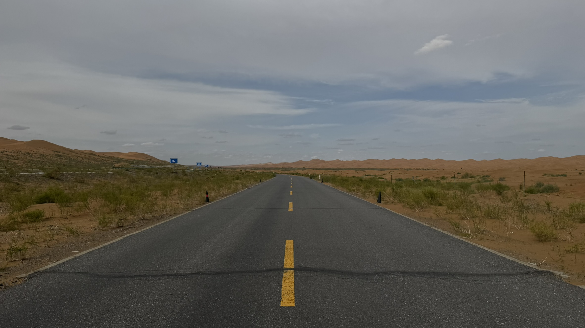
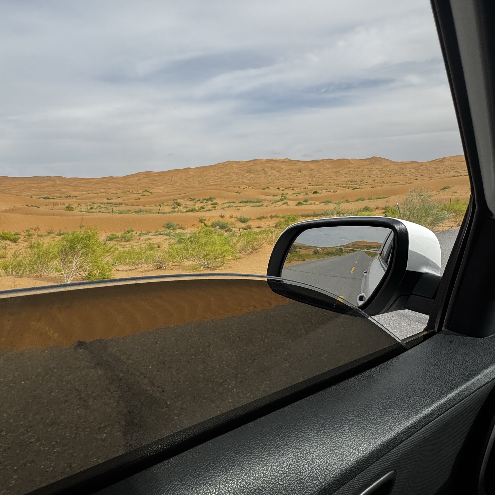

How many trips have we taken now? I've lost count. Although we've only gone to small places nearby, someday we'll definitely go abroad—to the sea, to the edge of the world, standing on the strangest rock or diving underwater. Road trips really are the best way to travel: not as tiring as walking, with the freedom to plan your own itinerary and stop to rest whenever you want. If there are few cars on the road and you're driving through open terrain like this, it's very comfortable. You can put food and drinks in the car, and more importantly, listen to music (I definitely need to buy a car with a great sound system someday), and bring along your loved one and friends.

This is Ningxia. We rented a Beijing Hyundai. Driving along the road, we could see cattle and horses, sheep, and camels by the roadside (Little Py was very excited). Over these two days we mainly went to two places: one was the Tengger Desert, which is said to be the fourth-largest desert in the world and is a natural desert; the other was Shapotou, a developed desert tourist attraction where you can do some activities. The self-driving route is all over Xiaohongshu. You just keep driving along the provincial road through the Tengger Desert. One section is a bit narrow, but overall it's very easy to drive. On the last stretch I even let Py drive for a while—this was probably her first time driving after getting her license. At first she wobbled left and right, then she just floored it.

Shapotou was pretty fun too, even though I don't have a good impression of tourist attractions in general—they're all identical copies. Every cultural building gets turned into a snack street, souvenir shops, and hand cream shops. Travel shouldn't be like this at all. By comparison, I'd rather take a small camera to a wet market, into the alleys, or sit for a while by an unknown lake and just space out. That's nice too.