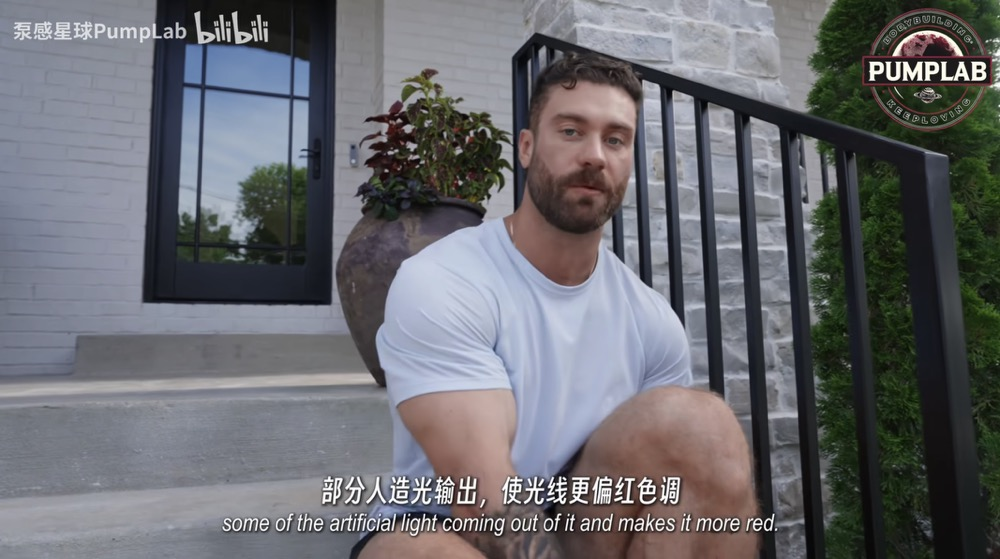
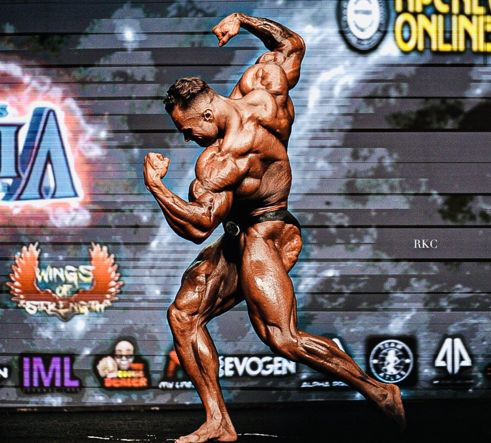

其实一切都取决于你到底怎么想，而且其实人们往往都清楚自己应该怎么做。我们唯一需要的就是专注、勇气和虔诚。网络上拥有你所需要的一切知识，你真的不需要去找一个私人教练（大多数情况下），也不需要看医生期望医生给你开一些吃了就能变大的药（我是说在身体没啥毛病只是想让身体变得更健康的情况下）。这就像是，你知道自己需要早睡早起，避免睡前看手机，做一些运动、拉伸，多喝水，多摄入干净的食物。但是你知道的，人总是去做更简单的事情而不是正确的事情，人总是在回避，在大脑中惯性最大的那条沟壑中顺流而下。很多时候你并不是真的想要做什么，想要成绩好，想要被别人注意，想要得到那个工作机会，你只是害怕被别人落下，害怕不合群，害怕社会的评价体系。恐惧驱动只会导致恶性循环，人们慢慢变得没有创造力，没有动力，没有目标也不知道自己想要什么。

解决办法看起来简单，‘找到你真正想要做的事情’，拥有诗也拥有面包。但是谁他妈知道呢。常常感觉属于自己的生活正在远处某个地方发生，只有当我们真正置身于那里的时候，才不用再去思考这个问题。在闭上眼的时候，雨滴落下来，在看着镜子里自己的时候，我们都隐隐约约的看到一条路，一种可能性。问题就又回到了你到底有多想，你到底有多想练出好的身材，才能像牛一样咽下所有的食物，关心热量和糖分，雷打不动的出现在健身房，强迫自己睡眠，通过阳光调节身体，分析自己的状态，疼痛和虚弱的神经然后重新振作起来。一次一次推到极限，连接你的神经和肌肉，有一天突然看到镜子里的自己你知道自己已经不一样了，但是这还远远不够。

也并非只有偏执者才能取得成功，因为快乐，享受和放松都是获得成功的关键。和你爱的人深入交流有利于恢复，这是健身教练和营养书中不会写清楚的。