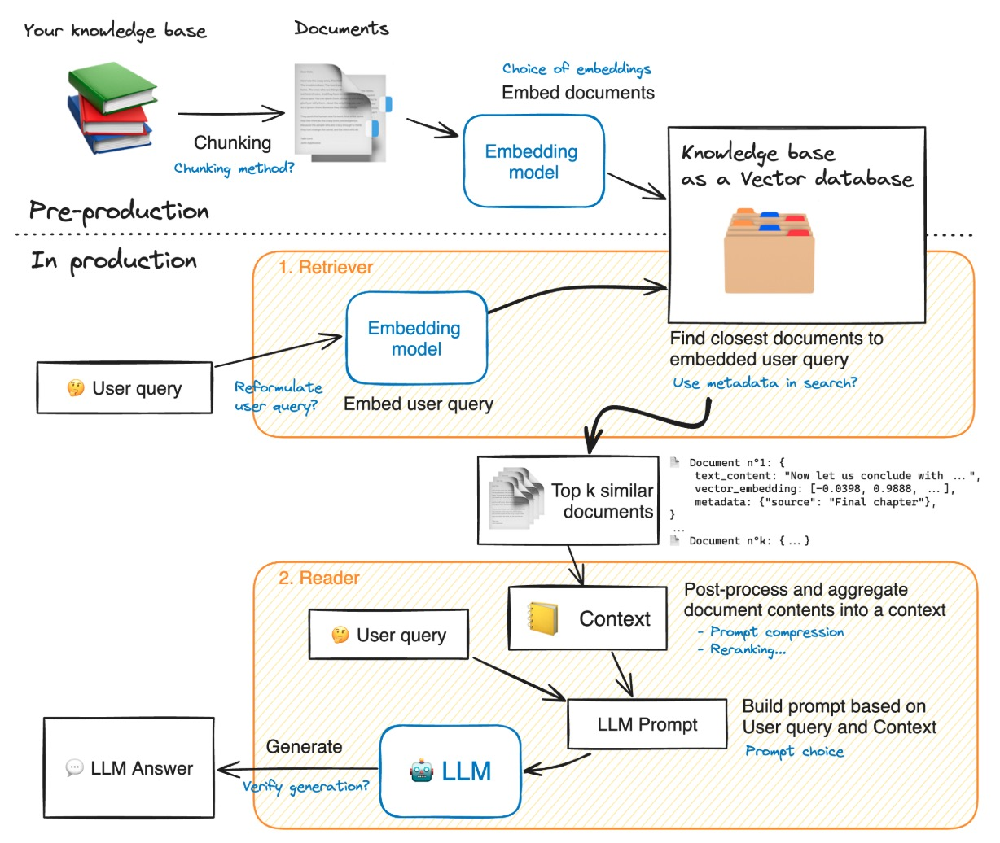
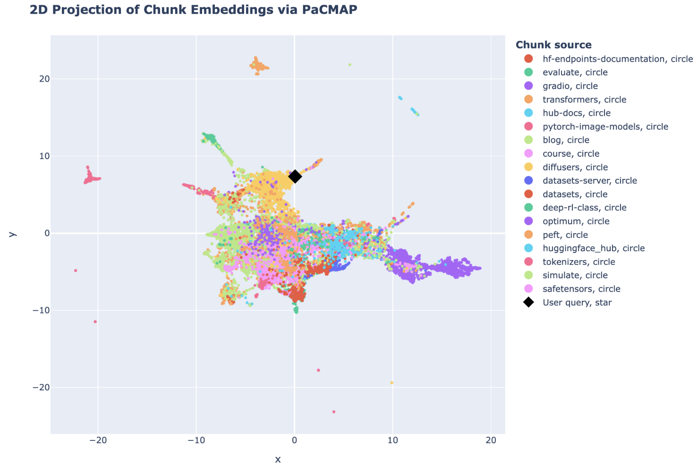

fixed-size vector representation，这其实就是我最近在学的核心主角了，我也是今天才知道它叫这个名字，就是embedding。

我们可以简单的认为，一个固定尺寸的向量表示一个知识点，知识库里放了成百上千这样的向量。llm收到一个query，只要把query也转换成向量然后计算它在这个向量库里距离最近的几个向量分别是什么，获取他们，那就相当于是用知识库的知识来回答用户的问题了。这里涉及很多步骤，我们一个个来。

首先我们要生成一个固定尺寸向量库，这需要使用embedding模型，它是一个可以将文本编码成固定尺寸向量表示的编码器。这里涉及到两个技术点，将哪些内容输入模型（输入数据的格式）；以及，选用什么模型以及是否要对模型进行微调。

我们应该选取一种将文本输入模型进行编码的形式，我们可能有一篇新闻报道，一篇论文或者一篇个人博客，将整篇整段放进模型进行编码也许不是一个好选择。用户的问题可能难以直接和代表整篇文章的向量匹配成功，而往往是文章的标题，或者某一个关键词（如”天气很好“会和”太阳好大“匹配）。所以我们需要一个chunk策略对文本切片同时选取适合任务场景的embedding模型对文本进行编码（美食网站和健身网站对于“沙拉”和“我好爱”的向量相似度可能不同）。

同时我们还应该对用户的问题进行重新表述，并且也选取合适的embedding模型（一般是和创建RAG时使用的同一个）将问题转换为向量，这样才能进行计算。（健美先生和可爱的肥宅同时提出“给我推荐一些好吃的”的时候对应的向量表示可能不那么一致）。

向量库有了，用户的问题也变成了向量，我们可以很简单的计算两个向量的相似程度，并且得到一个相似度排序，此时我们可以选取 top k个最相似的文档和用户query一起（组成一个prompt）返回给llm，也可以做进一步处理（比如重排序等后处理）。

流程稍微有点复杂，但是合理的架构节省了大量的上下文却让llm获得了强大的检索能力，并且，这就像是它理论上能够检索也就是学习任何领域任意数量的信息。llm的知识在训练完成那一刻就停止了，在有限的模型上下文中外挂的RAG库赋予了llm更多更准确有时效性的知识，并且在一定程度上减少了幻觉问题。

还有个问题，何时使用它呢？也许我们不希望我只是问一下现在几点了然后Agent就去RAG库里翻翻找找返回 top k个最佳匹配然后整理给llm得出答案。合理的方式是让Agent自己决定是否需要调用RAG工具来获取额外的特定的信息。我们将RAG检索写成一个tool_call的形式，描述它的作用以及在何时可以调用，同时给每个RAG库带上描述它含有哪些知识的标签，从而让llm自行决定调用RAG工具并且选择最合适的知识库进行检索。还有很多优化措施，比如相似度阈值兜底，如果不够就换个库检索或者不采用等等。

**references**

[1][Advanced RAG on Hugging Face documentation using LangChain](https://huggingface.co/learn/cookbook/en/advanced_rag?utm_source=chatgpt.com)
