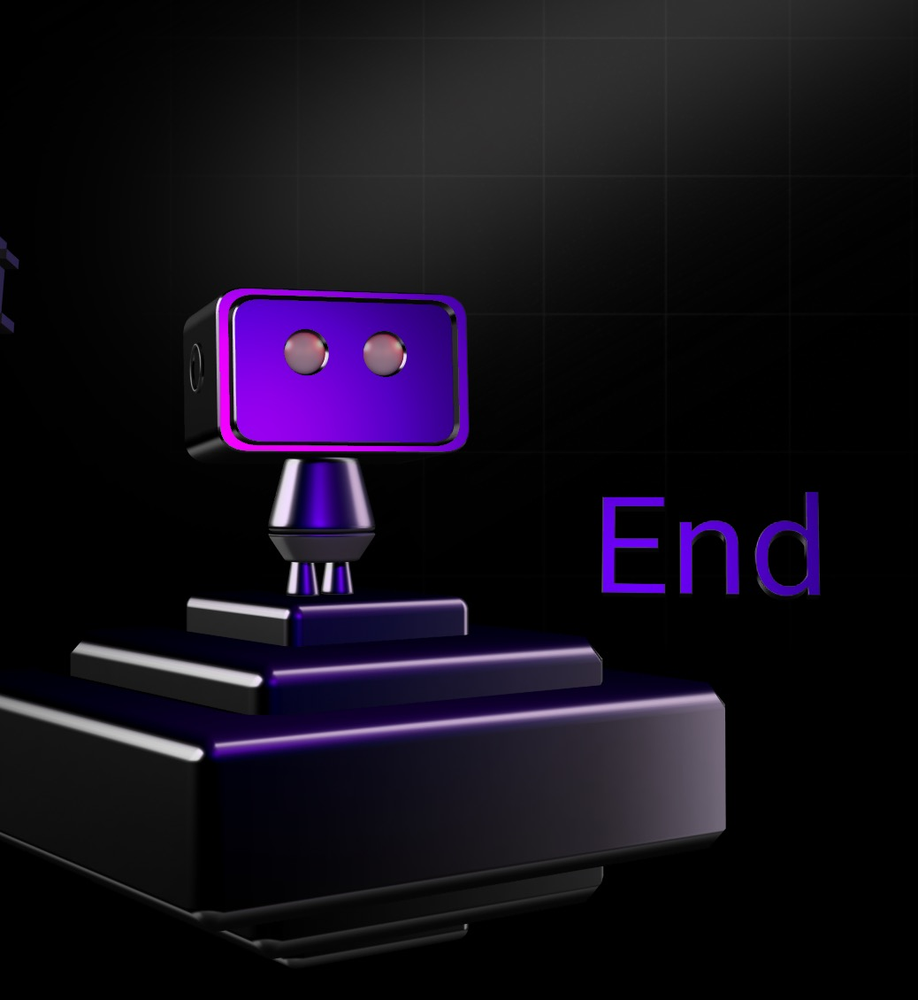

Model: [SmolVLA 450M](https://github.com/huggingface/lerobot?utm_source=chatgpt.com)

Framework: Huggingface LeRobot

Simulation: directly simulate the robotic arm with Python

Dataset: Generate expert trajectories using inverse kinematics algorithm -> convert to LeRobot dataset
- Action: "[angle, angle]"
- Language: "Move to the cursor"

Training: SmolVLA fine-tuning