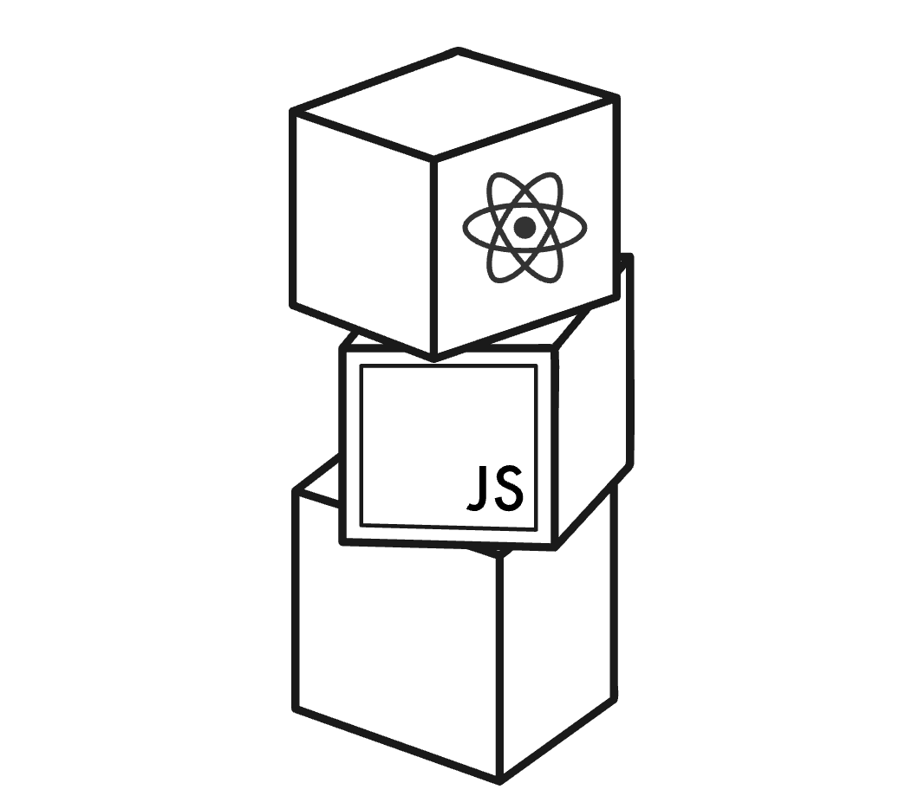

<div align="center">



</div>

### Part 0

This section covers the evolution from the original HTML web page execution process (sending an HTTP request to the server, the server handling the POST request and returning a 302 status code, which in turn requires the browser to redirect by making an HTTP GET request to the Location and then retrieve HTML, CSS, JS...) to today's full-stack development, where JavaScript programs run in the browser without further HTTP requests.

What exactly does full-stack development mean? A web service often consists of a frontend—the part closest to the user—at the top layer; it also includes a backend, a service on the server that listens for requests from the frontend and provides specific functionality; and there is often a database beneath the backend. This forms a three-layer stack, which is what we call full stack. The emergence of JavaScript has made it possible to develop the full stack using the same programming language, taking development into a new dimension.

### The React journey begins

In React, we don't write code in the index file. More precisely, the `index.html` file doesn't contain any HTML markup visible in the browser. Everything that needs to be rendered is defined as **React components** — it is quite accurate to describe **components** as UI building blocks.

Use arrow functions to create functions. `()` means the function contains no parameters:

```javascript
const APP = () => {
  return (
    <div>
      <p>Hello world</p>
    </div>
  )
}
```

Here the component is defined as a function. A function can contain any kind of JavaScript code, not just return this HTML. And now the `App.jsx` file we are writing is not JavaScript; it is a syntax extension of JavaScript that lets us use HTML-like markup inside it, and it is automatically compiled to JavaScript during compilation. Remember that every tag in JSX must be closed. Any JavaScript code inside curly braces will be executed. In other words, if a value is the result of a JavaScript expression, remember to wrap it in curly braces.

Always remember to write `console.log()` in your code to print information to the console; this is worthwhile. Also, React component names **must start with an uppercase letter**. In addition, React's children must be primitive values, such as numbers or strings, and cannot be objects.

---

### Learning JavaScript syntax

**Commonly used functions:**

`const` defines a constant whose value cannot be changed; `let` defines an ordinary variable.
`forEach` receives a **function defined with an arrow function** as a parameter.

```typescript
t.forEach(value => {
  console.log(value)  // numbers 1, -1, 3, 5 are printed, each on its own line
})      
```

`concat()` returns a new array containing the new elements.
`map()`

**Objects:**

- How to define an object: use curly braces to list the object's property values.
- How to refer to an object: use `.` or square brackets.
- An arrow function like `p => p * p` directly returns the value of the expression when used without parentheses.

const result = average(2, 5)
// result is now 3.5