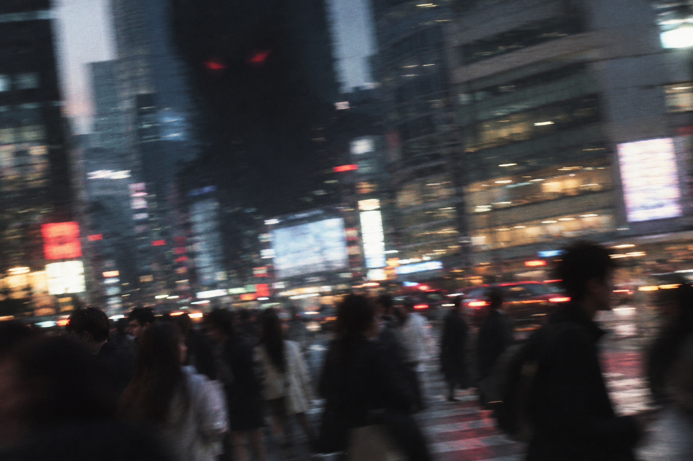

While riding my bike the other day, I suddenly remembered a news story I'd come across on Weibo: someone's parents were at home abroad, and the mother suddenly had a heart attack. But when the father tried to use his phone to call 911, an ad popped up that was nearly impossible to close, so the father had no choice but to knock on doors one by one to borrow a phone and call 911. I don't know whether it's true or not—I stay skeptical of everything I read online. But I've long been disgusted by this kind of recommendation mechanism in internet products, whether it's the endless pop-ups of Pinduoduo or Xiaohongshu's terrifying recommendation algorithm. They exist only for view counts and click-through rates, only to hold on to users and win out in market competition. To put it more bluntly: these algorithms were invented to make money—money by any means necessary.

All these tittytainment internet products keep stimulating users and pushing their thresholds ever higher. On the subway, everyone stands shoulder to shoulder, yet in the world of the internet they may be barely connected at all. With the crushing pressures of life, people will gradually lose the desire to choose for themselves, no longer exploring their own interests or trying to understand different issues. The internet doesn't need you to hold dialectical views or the capacity for sustained, long-form thinking; all it needs is a stance and emotion, and endless clicks.