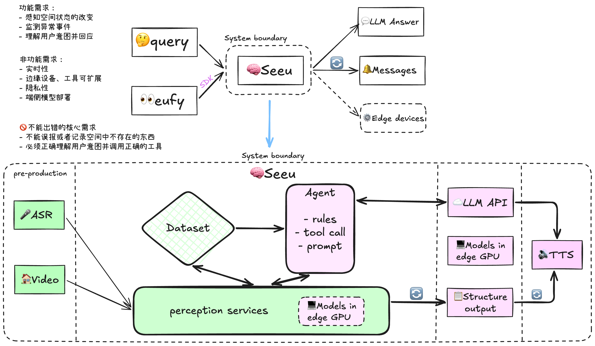
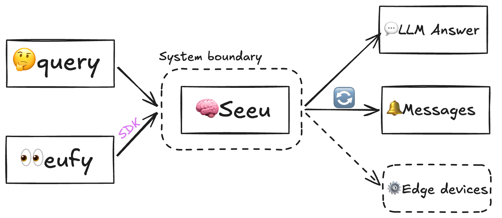
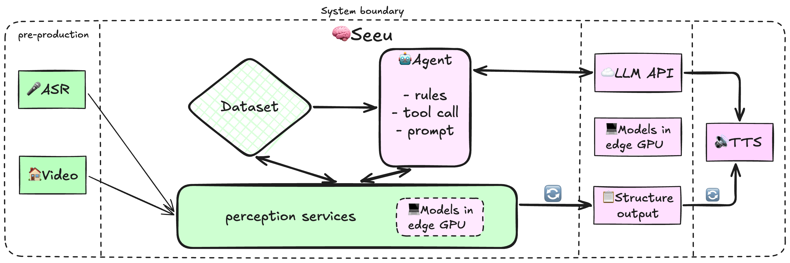
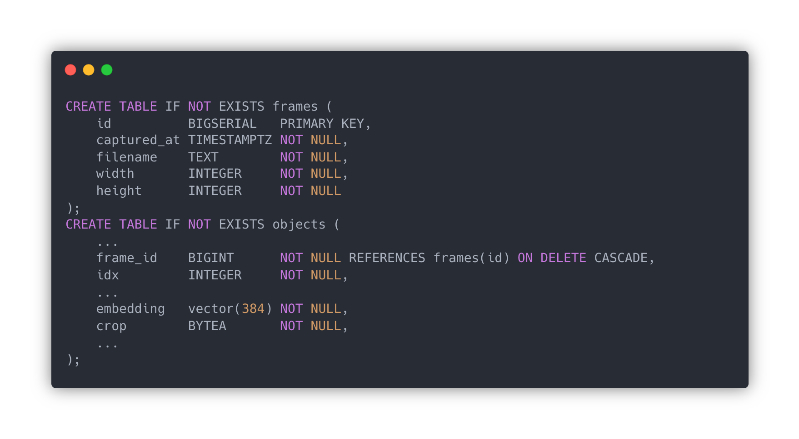
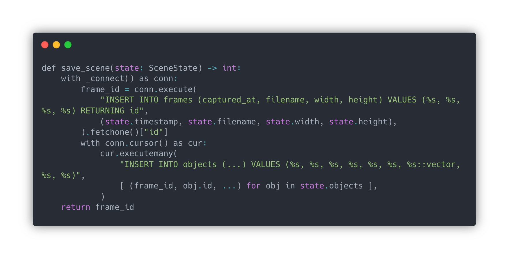
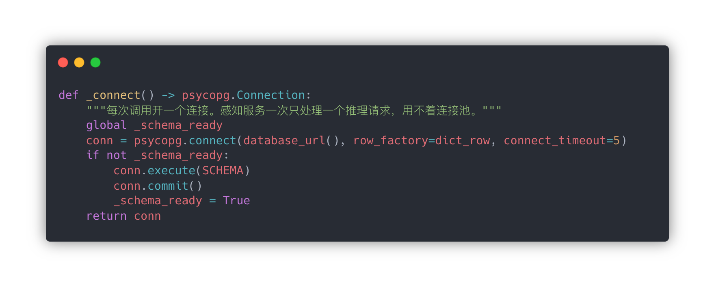
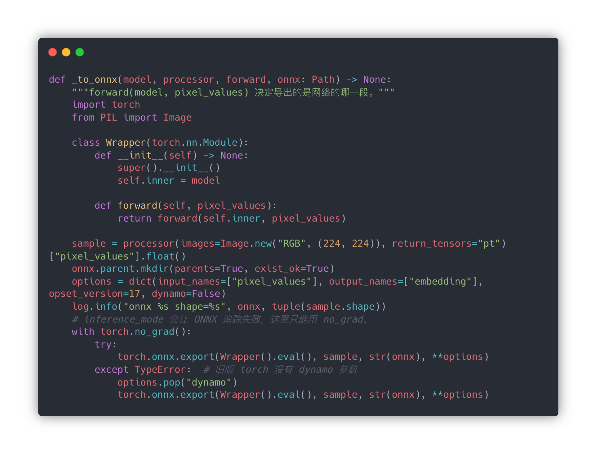
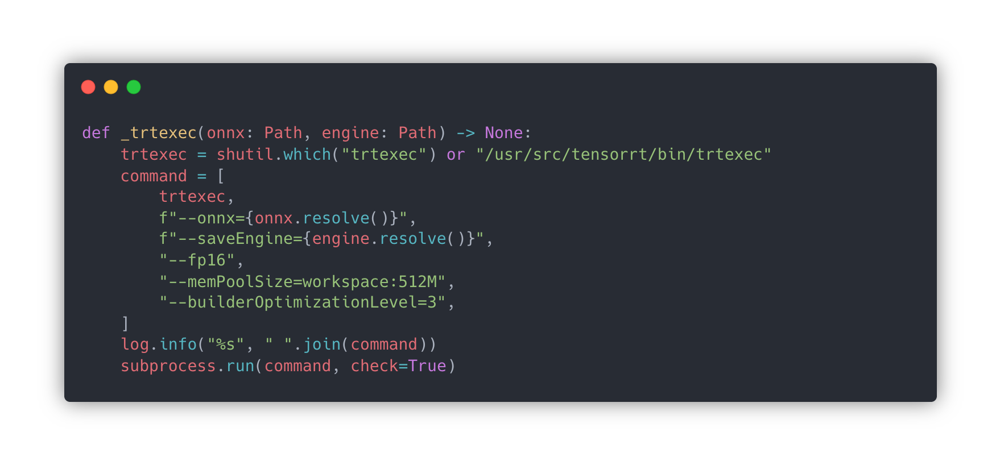
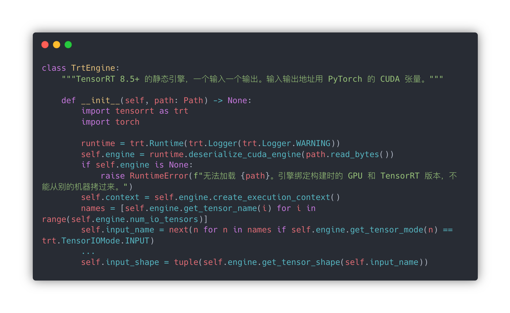
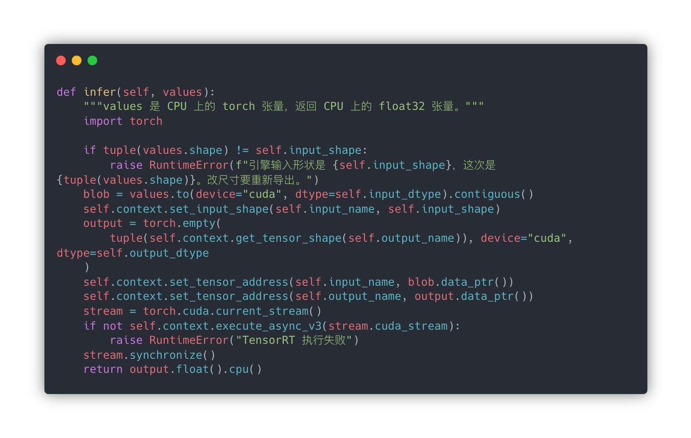

这是一个包含端侧运行视觉理解模型，并且能通过ARS/TTS和Agent技术与视障人士进行理解交互的AI应用项目。整个项目的检测流程核心方案和模型选型部署大概完成了，后续还应该优化数据库结构，ASR模块等。我准备通过4C模型来讲解整个项目的实现，包括Context、Container、Component、Code。

Seeu系统接收语音输入和监控视频流进行理解，结果输出给外部web系统或者语音系统循环更新当前空间感知信息，控制端侧设备，以及回复用户的问题。

感知服务作为系统核心服务控制端侧感知模型进行视觉理解和入库记录，将ASR结果转发给Agent，并提供Agent的工具调用接口。这里涉及很多通信，外部输入通过eufy官方SDK接入，感知服务收到图片输入后通过预编译好的.engine推理引擎执行感知流水线，直连PostgreSQL数据库写入时刻快照frames和空间物体objects两张表。ASR后的消息通过感知服务转发给Agent做理解，LLM answer输出通过SDK以及TTS处理后通过语音输出。

### 数据库架构 frames + objects

由于要记录时空状态，这涉及时间和空间两个维度，在时间轴上应该按照时间顺序记录每个检测时刻的空间快照，而物体信息应该包含检测时刻的信息，即该物体是在哪次检测中出现的。因此应该将frames作为objects的外键嵌入表中，当该时刻的快照被删除，对应时刻的物体也一并删除。

具体是怎么写入的呢。由于对于家庭监控场景来说同一时间只会运行一个场景流水线，在业务代码中用 `with _connet() as conn:` 来建立数据库连接并插入，with .. 能够保证事务一致性，完成后commit并清理数据库连接。

建立数据库连接是通过数据库的URL建立TCP连接，新建表或返回连接。

### 端侧部署优化 Pytorch -> ONNX -> TensorRT

端侧模型部署，最应该理解的技术是Pytorch -> ONNX -> TensorRT这条链路，模型当然可以通过Pytorch自带的框架计算，但是要逐层运行速度慢，占用显存多。ONNX提供了规范的节点类型，从而将不同推理框架转换成统一的计算图表示，具体而言ONNX中是：**节点类型 + 输入输出名 + 属性（如 kernel size）+ 权重。** 而TensorRT会从.onnx文件将其转换成.engine文件，将ONNX中的算子映射成tensorRT自己的Layer，将 ONNX 编译成、只能在特定 GPU + TensorRT 上加载运行的推理二进制；加载后就是 GPU 上可直接执行的那套优化过的网络。所以这是针对特定GPU和TensorRT编译过的，换了GPU换了TensorRT版本都可能出错。在运行的时候将.engine反序列化一下，然后pytorch将张量显存指针喂给tensorRT，GPU直接算，算完拷回CPU。

在代码中首先定义一个Wrapper包一下，这是因为torch.onnx.export要求必须是nn.Module，forward的参数就是输入张量，返回值就是输出张量。sample是一张样本输出图，所以这里的张量尺寸是固定的，也只有静态尺寸的张量用tensorRT优化的效果才更好。options是一个字典，确定输入输出名字，ONNX算子版本，和关闭新导出器使用tracing。然后就是跑一次病创建计算图，torch.no_grad() 关闭梯度但是还允许tracing，之后就能看到生成的ONNX图了。

这一步就只是调用NVIDIA的官方工具，总体来说就是tensorRT Runtime将ONNX编译成能在GPU上执行的二进制，针对这块GPU做了优化。
shutil.which("trtexec")：PATH 里找。找不到就用 Jetson 系统镜像的默认路径 /usr/src/tensorrt/bin/trtexec。电脑上没装 TensorRT 的话，这里会失败，这是正常的——引擎必须在目标 GPU 上编。
- onnx=...：读上一步的文件。
- saveEngine=...：写出 .engine。这是一段只有 TensorRT Runtime 能反序列化的二进制，里面是为 这块 GPU 的 SM 架构 选好的 kernel（用哪种子矩阵乘法、要不要 Tensor Core）。
- fp16：构建时把能转半精度的层转掉。权重在 ONNX 里还是 FP32，TensorRT 自己量化/转换。
- memPoolSize=workspace:512M：编译器的工作内存上限。
- builderOptimizationLevel=3：0 最快编完、引擎最慢；5 编最久、 theoretically 最快。3 是折中。
- subprocess.run(..., check=True)：返回码非 0 就抛异常。编译失败常见原因：ONNX 里有 TensorRT 不支持的算子、显存不够、opset 太新。

推理进程启动时不会再走ONNX，它只读.engine。
- trt.Runtime() 运行时只负责加载和执行；
- path.read_bytes() 整个.engine读进内存；
- deserialize_cuda_engine(path.read_bytes()) 把字节变成GPU上的引擎对象；
- create_execution_context() 有状态的，绑定显存上下文；
- input_shape 从引擎读出的输入格式，后面推理拿来校验。

形状校验，数据搬到GPU，引擎转成需要的精度，确保内存连续；在 Pytorch CUDA stream上异步启动，必须使用同一个stream，等GPU算完后 .cpu() 拷回张量。

业务代码接到引擎上的时候根本不加载大模型，存在引擎的时候直接使用引擎进行推理，不存在引擎的时候还是用pytorch。