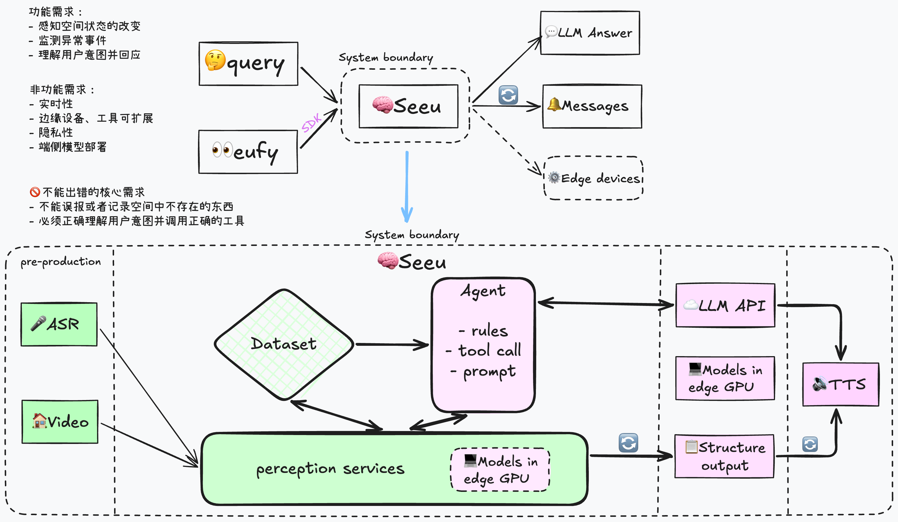

This is an AI application project that includes an on-device visual understanding model and can interact with visually impaired people through ASR/TTS and Agent technologies. The core detection pipeline solution and model selection/deployment for the project are roughly complete; going forward, the database structure, ASR module, and other parts should still be optimized. I plan to explain the implementation of the whole project through the 4C model, including Context, Container, Component, and Code.

The Seeu system receives voice input and surveillance video streams for understanding, and outputs the results to an external web system or voice system to continuously update the current spatial perception information, control on-device devices, and answer users' questions.

The perception service, as the system's core service, controls the on-device perception model to perform visual understanding and record storage, forwards ASR results to the Agent, and provides a tool-calling interface for the Agent. A lot of communication is involved here. External input is connected through the official eufy SDK. After the perception service receives image input, it executes the perception pipeline through a precompiled .engine inference engine and writes directly to the PostgreSQL database, inserting into the two tables frames and objects—moment snapshots and spatial objects, respectively. Messages after ASR are forwarded by the perception service to the Agent for understanding, and the LLM answer output is processed through the SDK and TTS and then output as voice.

### Database Architecture: frames + objects

Since spatiotemporal states need to be recorded, this involves two dimensions, time and space. On the time axis, the spatial snapshot at each detection moment should be recorded in chronological order, and object information should include information about the detection moment—that is, in which detection the object appeared. Therefore, frames should be embedded in the objects table as a foreign key, so that when the snapshot for that moment is deleted, the objects for the corresponding moment are also deleted.

How exactly is it written? For a home surveillance scenario, only one scenario pipeline runs at a time, so the business code uses `with _connet() as conn:` to establish a database connection and insert. `with ...` guarantees transaction consistency; after completion, it commits and cleans up the database connection.

Establishing a database connection means creating a TCP connection using the database URL, creating tables, or returning the connection.

### On-Device Deployment Optimization: PyTorch -> ONNX -> TensorRT

For on-device model deployment, the technology you should understand most is the PyTorch -> ONNX -> TensorRT chain. Of course, a model can be computed through PyTorch's built-in framework, but running it layer by layer is slow and consumes a lot of GPU memory. ONNX provides standardized node types, thereby converting different inference frameworks into a unified computational graph representation. Specifically, ONNX is: **node type + input/output names + attributes (such as kernel size) + weights.** TensorRT then converts the .onnx file into an .engine file, mapping ONNX operators to TensorRT's own layers and compiling ONNX into an inference binary that can only be loaded and run on a specific GPU + TensorRT; once loaded, it is the optimized network that can be directly executed on the GPU. So it is compiled for a specific GPU and TensorRT version; changing the GPU or TensorRT version may cause errors. At runtime, the .engine is deserialized, and then PyTorch feeds the tensor's GPU memory pointer to TensorRT; the GPU computes directly, and when done, the result is copied back to the CPU.

In the code, first define a Wrapper to wrap it. This is because `torch.onnx.export` requires it to be an `nn.Module`; the parameters of `forward` are the input tensors, and the return value is the output tensor. `sample` is a sample input image, so the tensor size here is fixed; only static-size tensors get better optimization from TensorRT. `options` is a dictionary that determines the input/output names, the ONNX operator version, and disables the new exporter to use tracing. Then run it once and create the computational graph. `torch.no_grad()` disables gradients but still allows tracing, after which you can see the generated ONNX graph.

This step just calls NVIDIA's official tool. Overall, TensorRT Runtime compiles ONNX into a binary that can execute on the GPU, optimized for this particular GPU.
`shutil.which("trtexec")`: looks in PATH. If not found, use the default path from the Jetson system image, `/usr/src/tensorrt/bin/trtexec`. If TensorRT is not installed on the computer, this will fail, which is normal—the engine must be compiled on the target GPU.
- `onnx=...`: reads the file from the previous step.
- `saveEngine=...`: writes out the .engine. This is a binary that only TensorRT Runtime can deserialize, containing kernels selected for this GPU's SM architecture (which kind of submatrix multiplication to use, whether to use Tensor Cores).
- `fp16`: during build, converts layers that can be converted to half precision. Weights in ONNX are still FP32; TensorRT quantizes/converts them itself.
- `memPoolSize=workspace:512M`: the upper limit of the compiler's working memory.
- `builderOptimizationLevel=3`: 0 compiles fastest and produces the slowest engine; 5 takes longest to compile and is theoretically fastest. 3 is a compromise.
- `subprocess.run(..., check=True)`: if the return code is non-zero, it throws an exception. Common causes of compilation failure: ONNX contains operators not supported by TensorRT, insufficient GPU memory, or the opset is too new.

When the inference process starts, it no longer goes through ONNX; it only reads the .engine.
- trt.Runtime() is only responsible for loading and execution at runtime;
- path.read_bytes() reads the entire .engine into memory;
- deserialize_cuda_engine(path.read_bytes()) turns the bytes into an engine object on the GPU;
- create_execution_context() is stateful and binds the GPU memory context;
- input_shape is the input format read from the engine, later used for validation during inference.

Shape validation, moving data to the GPU, converting it to the precision required by the engine, and ensuring memory is contiguous; launch asynchronously on a PyTorch CUDA stream, and the same stream must be used. After the GPU finishes computation, `.cpu()` copies the tensor back.

When the business code connects to the engine, it does not load the large model at all. If the engine exists, it directly uses the engine for inference; if the engine does not exist, it still uses PyTorch.